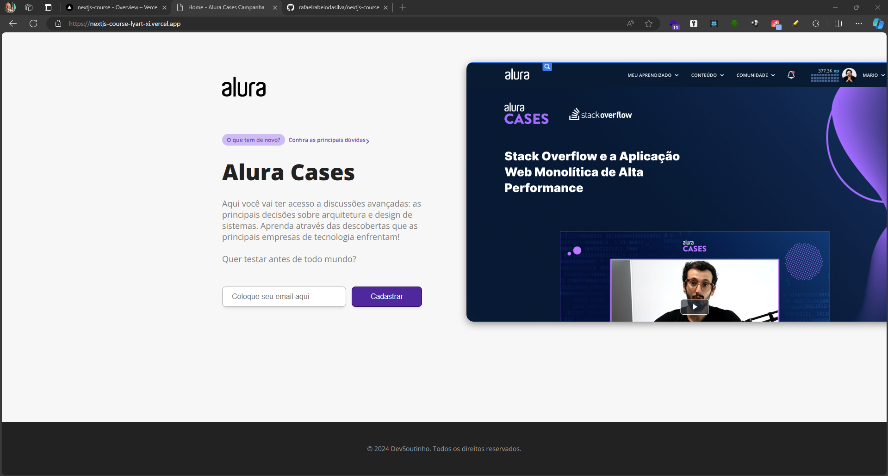

# Projeto Next.js ✨

## Sobre o Projeto 📚

Este projeto é parte de um curso introdutório sobre Next.js. No início do curso, aprendemos que o Next.js oferece a capacidade de renderização tanto do lado do servidor quanto do cliente, além de poder gerar páginas estáticas durante o processo de build. 
Exploramos também como o Next.js busca os dados da aplicação usando `GetServerSideProps` ou `GetStaticProps` para implementar diferentes estratégias de renderização e criamos o arquivo `next.config.js` que permite modificações de configurações, como redirecionamentos e adição de barras finais nas URLs automaticamente.

## Tecnologias Utilizadas 🧙‍♂️

- React v17.0.2
- Next v12.0.4

## Instalação 🪄

Antes de executar o projeto, é necessário seguir as etapas abaixo:

1. Instalação de Dependências: Execute o comando `$ npm install` ou `$ yarn install` para instalar todas as dependências do projeto.
2. Executar o Projeto em Modo de Desenvolvimento: Para executar o projeto localmente em modo de desenvolvimento, utilize o comando `$ npm run dev` ou `$ yarn dev`.
3. Build do Projeto: Caso deseje fazer o build do projeto para produção, execute o comando `$ npm run build` ou `$ yarn build`.
4. Executar o Projeto em Modo de Produção: Após o build, execute o comando `$ npm start` ou `$ yarn start` para iniciar o servidor em modo de produção.